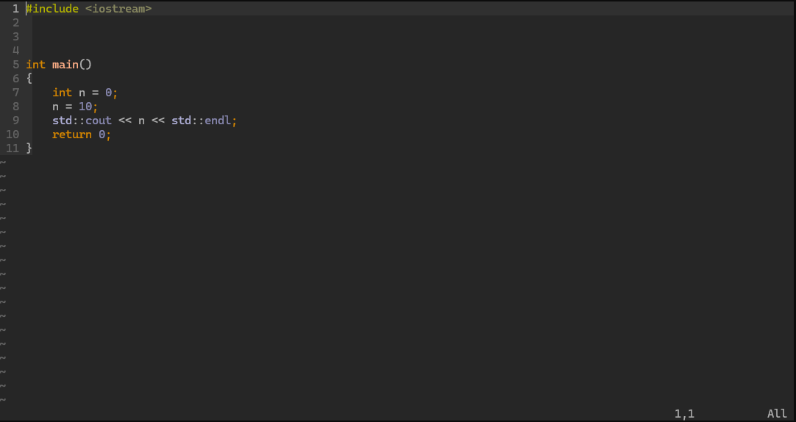
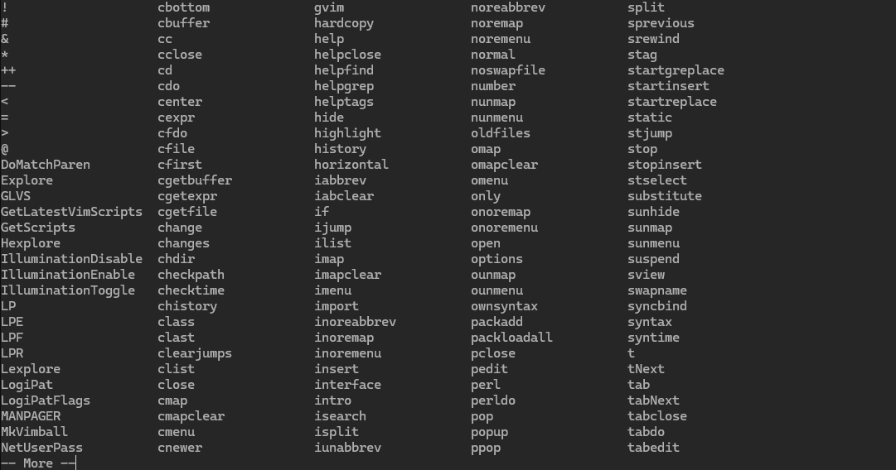
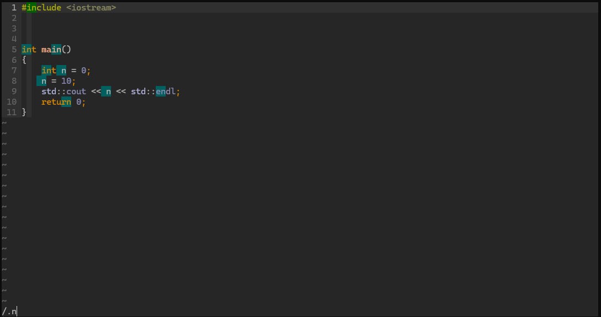

                                      ██╗   ██╗██╗███╗   ███╗██████╗  ██████╗                    
                                      ██║   ██║██║████╗ ████║██╔══██╗██╔════╝                    
                                      ██║   ██║██║██╔████╔██║██████╔╝██║                         
                                      ╚██╗ ██╔╝██║██║╚██╔╝██║██╔══██╗██║                         
                                       ╚████╔╝ ██║██║ ╚═╝ ██║██║  ██║╚██████╗                    
                                        ╚═══╝  ╚═╝╚═╝     ╚═╝╚═╝  ╚═╝ ╚═════╝                    

## My ultimate .vimrc configuration.

## To get this configuration simply run - 

### - curl <a href="https://github.com/llyaAlexandrovich/vimrc/blob/main/.vimrc" style="text-decoration: none; color: black;">https://github.com/llyaAlexandrovich/vimrc/blob/main/.vimrc</a> -o ~/.vimrc

### - (Linux only) sudo apt-get install dos2unix && dos2unix ~/.vimrc

### - (First time) vim -c PlugUpdate

## Features

### Command Palette

### 24-bit color support

### Smart regex and search

